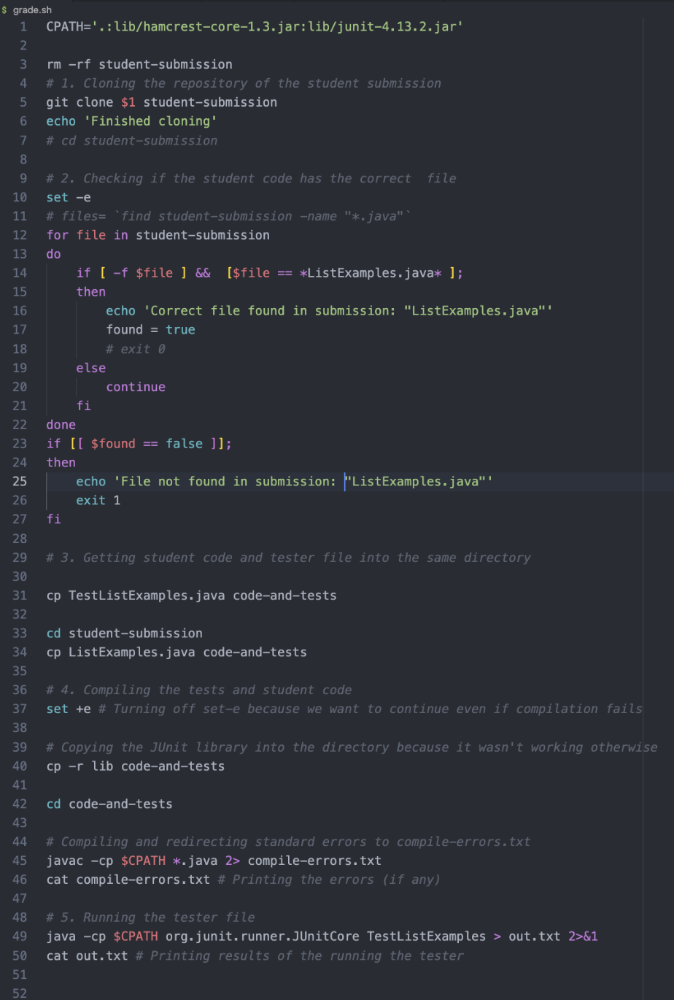
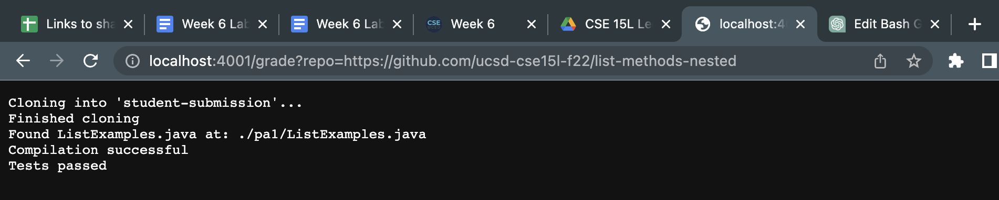

Tristan Cooper - A17085814
# Lab Report 5: Favorite Lab Activity

*Hello, and welcome to the Markdown page for my final CSE 15L Lab Report!*


For this lab report, I decided to dive back in to *Lab 6* (about creating a grading script) for 3 reasons:
1. My bash script felt incomplete; we never got to run it through a server.
2. It will be great practice for the upcoming skill demonstration.
3. Writing my own Autograder seems like a fun and practical application of what we've learned!

## PART 1: Finish the Grading Script
### My original grading script from lab (1st version):





## The adjustments I made to my `grade.sh`
### - The way I checked that the student submitted the correct file. *(Lines 12-27 above)*
Earlier, I was running a for loop through the student's submission directory, using a variable to represent a file in said directory. I was using `-f` and a two-part conditional, which proved to be buggy. This required an unnecessary boolean variable and another conditional. Additionally, I never told the script to `exit` when the file was found. The submission that motivated me to turn to ChatGPT to make my script better was the one where `ListExamples.java` is stored in a nested directory. In my correction, I used `find . -name` as well as two options that I had ChatGPT explain to me, `-print` and `-quit`. 
Here is ChatGPT's explanation of two lines below my comment in the new version:
```
Using -print with find prints the matching path and -quit stops the search after the first match. Similarly, using -n with echo disables the trailing newline character.
```


### - Where I stored the student's submission *(Lines 31,33,34,40, and 42)*
Previously, I was using `cp` to create a new directory called `code-and-tests` to "get the student's code and tester file into the same directory." This required me to run two more `cp` commands, one of which I used the `-r` option on. This was because I needed the JUnit libraries in the same directory that I was running the tests in. 
Turns out, all I needed to do was copy the path of the students submission to the directory I was currently in, using `cp ..`. This way, all the files and libraries I need are in the same spot. This also saved me from needing an extra `cd` command, which, if this were a real Autograder, I would imagine would save time in the long run.
### - How I reported pass/fail *(Lines 45-50)*
In my first draft of the script, I was simply redirecting the standard error to a `.txt` file and printing that entire file with `cat`. While it wasn't problematic, I thought an Autograder should probably report a more custom summary of the results from running tests than the given compile-time errors and JUnit output. I wanted to figure out a way to print a grade based on the score out of 100 that the student got, but I settled on printing just a select line from the JUnit output for the student so they didn't have to read through the entire JUnit summary. I did this by first adding a conditional that checked whether or not there were even any errors when running JUnit. Next, I utilized the `grep` command to search for the line in the JUnit output in my `.txt` file that corresponded to the number of tests passed and run, and printed that with `echo`.


### My new/revised Grading Script for this Lab Report:

``` bash
CPATH='.:lib/hamcrest-core-1.3.jar:lib/junit-4.13.2.jar'

rm -rf student-submission
# 1. Cloning the repository of the student submission
git clone $1 student-submission
echo 'Finished cloning'

# 2. Checking if the student code has the correct  file
set -e

cd student-submission

# Searching for the path with the file in it
# USED CHAT-CPT TO PRODUCE THE TWO LINES BELOW
list_examples_path=$(find . -name "ListExamples.java" -print -quit)
if [[ -n $list_examples_path ]]; then
    echo 'Correct file found in submission: "ListExamples.java"'
else
    echo 'File not found in submission: "ListExamples.java"'
    exit 1
fi

# 3. Copying the student code to the working directory with the tester file and lib
cp "$list_examples_path" ..

cd .. # Returning to code-and-tests directory in order to run JUnit

# 4. Compiling the tests and student code
set +e # Turning off set-e because we want to continue even if compilation fails

# Compiling and redirecting standard errors to compile-errors.txt
javac -cp $CPATH *.java
if [ $? -eq 0 ]; then
    echo "Compilation successful"
else
    echo "Compilation failed"
    exit 1
fi
# cat compile-errors.txt # Printing the errors (if any)

# 5. Running the tester file
java -cp $CPATH org.junit.runner.JUnitCore TestListExamples > out.txt 2>&1
if [ $? -eq 0 ]; then
    echo "Tests passed"
else
    echo "Tests failed. Statistics below."
    echo `grep "Tests run:" out.txt`
fi
# cat out.txt # Printing results of the running the tester
```

## PART 2: Running the script on several files

**Running on a submission that fails JUnit:**
URL.png)
This is an example of a submission that compiles, but does't pass the testers.
As you can see, when the submission fails JUnit, my script prints out the line from the JUnit error output with the statistics of the number of tests run and number of tests failed.
I think this way looks much cleaner than had I just done something like `cat jUnitOutput.txt`; this is given that we are trying to hide information from the student about which exact tests failed, of course. Otherwise, the JUnit output would often contain helpful information that we wouldn't want to censor.


**Running on a corrected submission that passes JUnit:**
URL.png)
In this example, the student's submission passed both compilation and testers.

**Running on a submission with the desired file in a nested directory**

This example tests my script's ability to search several paths for the student's file, thanks to AI, and surprisingly, without a for loop (the power of `find`)!

# That's it! Thank you so much for reading and grading all my lab reports for this quarter!
